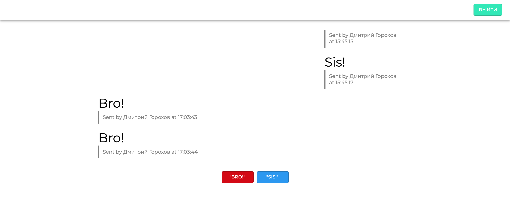
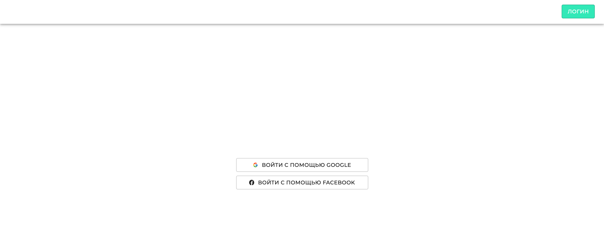

### Web приложение которое позволяет пользователям аутентифицироваться через соцсети

[Database](https://firebase.google.com/?gclid=CjwKCAjwzt6LBhBeEiwAbPGOgfiWv3zHQHLefmYRawBZ9pyT-R0Z1Nh1T3Z6JxB727DgxGbvn5yjexoC30AQAvD_BwE&gclsrc=aw.ds)

### Libraries used

- `firebase`
- `react-firebase-hooks`
- `react-router-dom`
- `material-ui`
- `react-icons`

---

### Font

- Font Link: [fonts.google.com](https://fonts.google.com/specimen/Montserrat?query=m)

### Images

